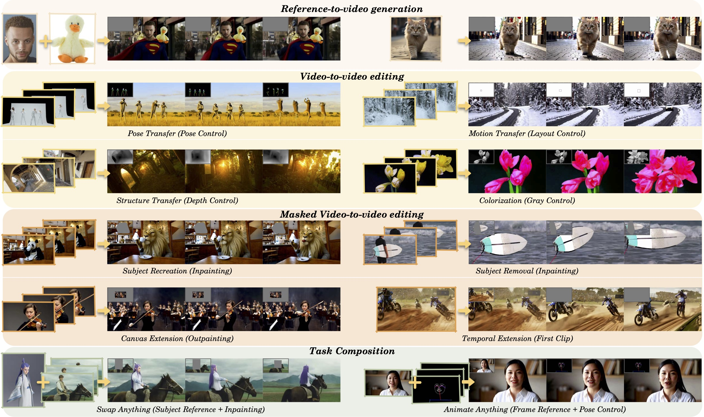

<p align="center">

<h1 align="center">VACE: All-in-One Video Creation and Editing</h1>
<p align="center">
    <strong>Zeyinzi Jiang<sup>*</sup></strong>
    ·
    <strong>Zhen Han<sup>*</sup></strong>
    ·
    <strong>Chaojie Mao<sup>*&dagger;</sup></strong>
    ·
    <strong>Jingfeng Zhang</strong>
    ·
    <strong>Yulin Pan</strong>
    ·
    <strong>Yu Liu</strong>
    <br>
    <b>Tongyi Lab - <a href="https://github.com/Wan-Video/Wan2.1"></a> </b>
    <br>
    <br>
        <a href="https://arxiv.org/abs/2503.07598"></a>
        <a href="https://ali-vilab.github.io/VACE-Page/"></a>
        <a href="https://huggingface.co/collections/ali-vilab/vace-67eca186ff3e3564726aff38"></a>
        <a href="https://modelscope.cn/collections/VACE-8fa5fcfd386e43"></a>
    <br>
</p>


## Introduction
<strong>VACE</strong> is an all-in-one model designed for video creation and editing. It encompasses various tasks, including reference-to-video generation (<strong>R2V</strong>), video-to-video editing (<strong>V2V</strong>), and masked video-to-video editing (<strong>MV2V</strong>), allowing users to compose these tasks freely. This functionality enables users to explore diverse possibilities and streamlines their workflows effectively, offering a range of capabilities, such as Move-Anything, Swap-Anything, Reference-Anything, Expand-Anything, Animate-Anything, and more.




## 🎉 News
- [x] Mar 31, 2025: 🔥VACE-Wan2.1-1.3B-Preview and VACE-LTX-Video-0.9 models are now available at [HuggingFace](https://huggingface.co/collections/ali-vilab/vace-67eca186ff3e3564726aff38) and [ModelScope](https://modelscope.cn/collections/VACE-8fa5fcfd386e43)!
- [x] Mar 31, 2025: 🔥Release code of model inference, preprocessing, and gradio demos. 
- [x] Mar 11, 2025: We propose [VACE](https://ali-vilab.github.io/VACE-Page/), an all-in-one model for video creation and editing.


## 🪄 Models
| Models                   | Download Link                                                                                                                                                                           | Video Size          | License                                                                                       |
|--------------------------|---------------------------------------------------------------------------------------------------------------------------------------------------------------------------------------|---------------------|-----------------------------------------------------------------------------------------------|
| VACE-Wan2.1-1.3B-Preview | [Huggingface](https://huggingface.co/ali-vilab/VACE-Wan2.1-1.3B-Preview) 🤗  [ModelScope](https://modelscope.cn/models/iic/VACE-Wan2.1-1.3B-Preview) 🤖                                                                                                                                                                   | ~ 81 x 480 x 832    | [Apache-2.0](https://huggingface.co/Wan-AI/Wan2.1-T2V-1.3B/blob/main/LICENSE.txt)             |
| VACE-LTX-Video-0.9       | [Huggingface](https://huggingface.co/ali-vilab/VACE-LTX-Video-0.9) 🤗     [ModelScope](https://modelscope.cn/models/iic/VACE-LTX-Video-0.9) 🤖                                                                                                                                                                   | ~ 97 x 512 x 768    | [RAIL-M](https://huggingface.co/Lightricks/LTX-Video/blob/main/ltx-video-2b-v0.9.license.txt) |
| Wan2.1-VACE-1.3B             | [To be released](https://github.com/Wan-Video)   | ~ 81 x 480 x 832    | [Apache-2.0](https://huggingface.co/Wan-AI/Wan2.1-T2V-1.3B/blob/main/LICENSE.txt)             |
| Wan2.1-VACE-14B          | [To be released](https://github.com/Wan-Video)   | ~ 81 x 720 x 1080   | [Apache-2.0](https://huggingface.co/Wan-AI/Wan2.1-T2V-14B/blob/main/LICENSE.txt)             |

- The input supports any resolution, but to achieve optimal results, the video size should fall within a specific range.
- All models inherit the license of the original model.


## ⚙️ Installation
The codebase was tested with Python 3.10.13, CUDA version 12.4, and PyTorch >= 2.5.1.

### Setup for Model Inference
You can setup for VACE model inference by running:
```bash
git clone https://github.com/ali-vilab/VACE.git && cd VACE
pip install torch==2.5.1 torchvision==0.20.1 --index-url https://download.pytorch.org/whl/cu124  # If PyTorch is not installed.
pip install -r requirements.txt
pip install wan@git+https://github.com/Wan-Video/Wan2.1  # If you want to use Wan2.1-based VACE.
pip install ltx-video@git+https://github.com/Lightricks/LTX-Video@ltx-video-0.9.1 sentencepiece --no-deps # If you want to use LTX-Video-0.9-based VACE. It may conflict with Wan.
```
Please download your preferred base model to `<repo-root>/models/`. 

### Setup for Preprocess Tools
If you need preprocessing tools, please install:
```bash
pip install -r requirements/annotator.txt
```
Please download [VACE-Annotators](https://huggingface.co/ali-vilab/VACE-Annotators) to `<repo-root>/models/`.

### Local Directories Setup
It is recommended to download [VACE-Benchmark](https://huggingface.co/datasets/ali-vilab/VACE-Benchmark) to `<repo-root>/benchmarks/` as examples in `run_vace_xxx.sh`.

We recommend to organize local directories as:
```angular2html
VACE
├── ...
├── benchmarks
│   └── VACE-Benchmark
│       └── assets
│           └── examples
│               ├── animate_anything
│               │   └── ...
│               └── ...
├── models
│   ├── VACE-Annotators
│   │   └── ...
│   ├── VACE-LTX-Video-0.9
│   │   └── ...
│   └── VACE-Wan2.1-1.3B-Preview
│       └── ...
└── ...
```

## 🚀 Usage
In VACE, users can input **text prompt** and optional **video**, **mask**, and **image** for video generation or editing.
Detailed instructions for using VACE can be found in the [User Guide](./UserGuide.md).

### Inference CIL
#### 1) End-to-End Running
To simply run VACE without diving into any implementation details, we suggest an end-to-end pipeline. For example:
```bash
# run V2V depth
python vace/vace_pipeline.py --base wan --task depth --video assets/videos/test.mp4 --prompt 'xxx'

# run MV2V inpainting by providing bbox
python vace/vace_pipeline.py --base wan --task inpainting --mode bbox --bbox 50,50,550,700 --video assets/videos/test.mp4 --prompt 'xxx'
```
This script will run video preprocessing and model inference sequentially, 
and you need to specify all the required args of preprocessing (`--task`, `--mode`, `--bbox`, `--video`, etc.) and inference (`--prompt`, etc.). 
The output video together with intermediate video, mask and images will be saved into `./results/` by default.

> 💡**Note**:
> Please refer to [run_vace_pipeline.sh](./run_vace_pipeline.sh) for usage examples of different task pipelines.


#### 2) Preprocessing
To have more flexible control over the input, before VACE model inference, user inputs need to be preprocessed into `src_video`, `src_mask`, and `src_ref_images` first.
We assign each [preprocessor](./vace/configs/__init__.py) a task name, so simply call [`vace_preprocess.py`](./vace/vace_preproccess.py) and specify the task name and task params. For example:
```angular2html
# process video depth
python vace/vace_preproccess.py --task depth --video assets/videos/test.mp4

# process video inpainting by providing bbox
python vace/vace_preproccess.py --task inpainting --mode bbox --bbox 50,50,550,700 --video assets/videos/test.mp4
```
The outputs will be saved to `./processed/` by default.

> 💡**Note**:
> Please refer to [run_vace_pipeline.sh](./run_vace_pipeline.sh) preprocessing methods for different tasks.
Moreover, refer to [vace/configs/](./vace/configs/) for all the pre-defined tasks and required params.
You can also customize preprocessors by implementing at [`annotators`](./vace/annotators/__init__.py) and register them at [`configs`](./vace/configs).


#### 3) Model inference
Using the input data obtained from **Preprocessing**, the model inference process can be performed as follows:
```bash
# For Wan2.1 single GPU inference 
python vace/vace_wan_inference.py --ckpt_dir <path-to-model> --src_video <path-to-src-video> --src_mask <path-to-src-mask> --src_ref_images <paths-to-src-ref-images> --prompt "xxx"

# For Wan2.1 Multi GPU Acceleration inference
pip install "xfuser>=0.4.1"
torchrun --nproc_per_node=8 vace/vace_wan_inference.py --dit_fsdp --t5_fsdp --ulysses_size 1 --ring_size 8 --ckpt_dir <path-to-model> --src_video <path-to-src-video> --src_mask <path-to-src-mask> --src_ref_images <paths-to-src-ref-images> --prompt "xxx"

# For LTX inference, run
python vace/vace_ltx_inference.py --ckpt_path <path-to-model> --text_encoder_path <path-to-model> --src_video <path-to-src-video> --src_mask <path-to-src-mask> --src_ref_images <paths-to-src-ref-images> --prompt "xxx"
```
The output video together with intermediate video, mask and images will be saved into `./results/` by default.

> 💡**Note**: 
> (1) Please refer to [vace/vace_wan_inference.py](./vace/vace_wan_inference.py) and [vace/vace_ltx_inference.py](./vace/vace_ltx_inference.py) for the inference args.
> (2) For LTX-Video and English language Wan2.1 users, you need prompt extension to unlock the full model performance. 
Please follow the [instruction of Wan2.1](https://github.com/Wan-Video/Wan2.1?tab=readme-ov-file#2-using-prompt-extension) and set `--use_prompt_extend` while running inference.
> (3) When performing prompt extension in editing tasks, it's important to pay attention to the results of expanding plain text. Since the visual information being input is unknown, this may lead to the extended output not matching the video being edited, which can affect the final outcome.

### Inference Gradio
For preprocessors, run 
```bash
python vace/gradios/preprocess_demo.py
```
For model inference, run
```bash
# For Wan2.1 gradio inference
python vace/gradios/vace_wan_demo.py

# For LTX gradio inference
python vace/gradios/vace_ltx_demo.py
```

## Acknowledgement

We are grateful for the following awesome projects, including [Scepter](https://github.com/modelscope/scepter), [Wan](https://github.com/Wan-Video/Wan2.1), and [LTX-Video](https://github.com/Lightricks/LTX-Video).


## BibTeX

```bibtex
@article{vace,
    title = {VACE: All-in-One Video Creation and Editing},
    author = {Jiang, Zeyinzi and Han, Zhen and Mao, Chaojie and Zhang, Jingfeng and Pan, Yulin and Liu, Yu},
    journal = {arXiv preprint arXiv:2503.07598},
    year = {2025}
}