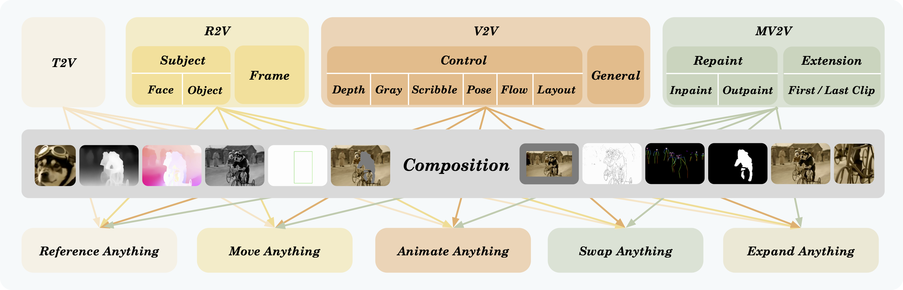
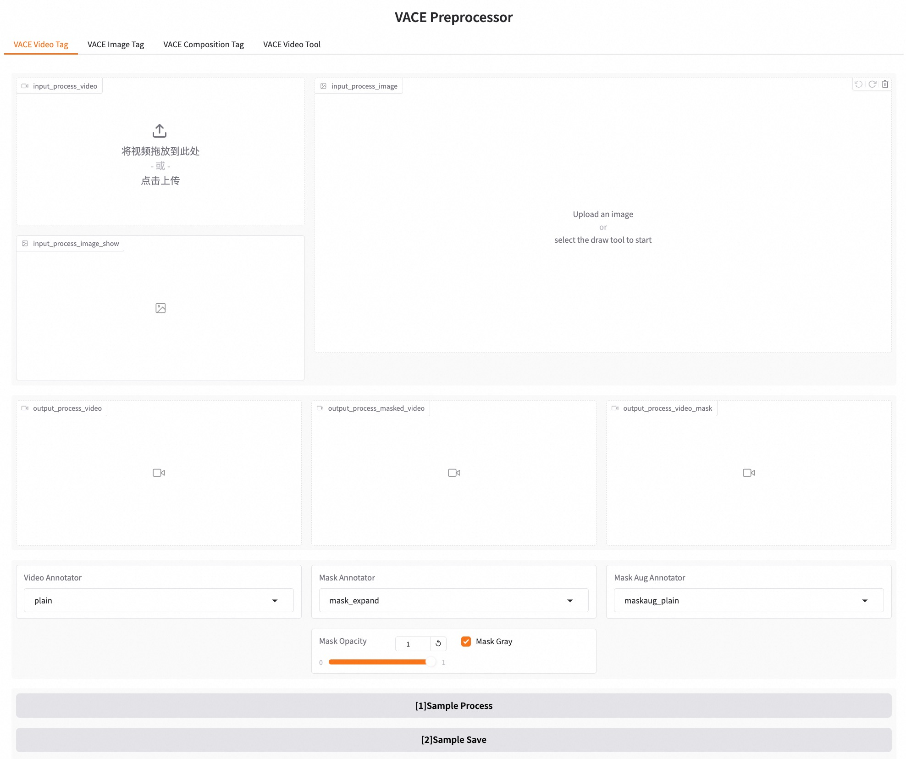
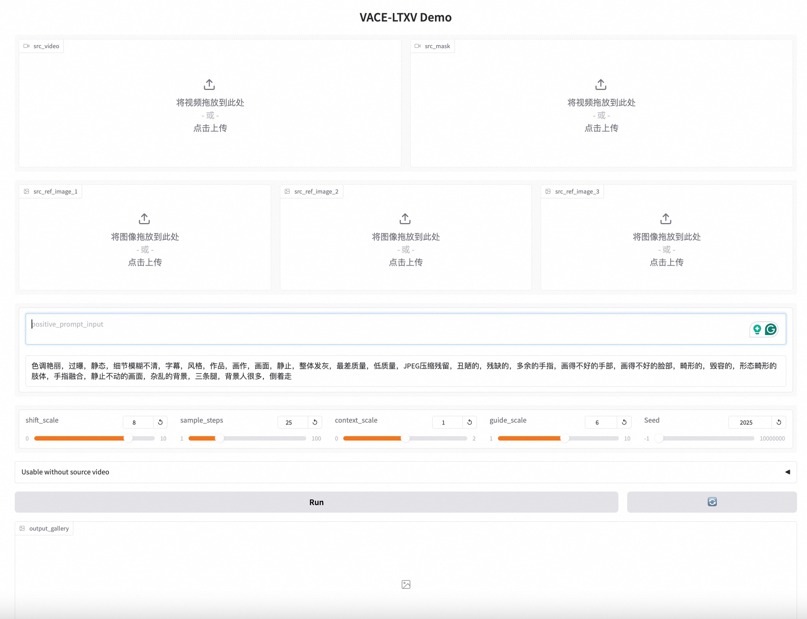

# VACE User Guide

## 1. Overall Steps

- Preparation: Be aware of the task type ([single task](#32-single-task) or [multi-task composition](#33-composition-task)) of your creative idea, and prepare all the required materials (images, videos, prompt, etc.)
- Preprocessing: Select the appropriate preprocessing method based task name, then preprocess your materials to meet the model's input requirements.
- Inference: Based on the preprocessed materials, perform VACE inference to obtain results.

## 2. Preparations

### 2.1 Task Definition

VACE, as a unified video generation solution, simultaneously supports Video Generation, Video Editing, and complex composition task. Specifically:

- Video Generation: No video input. Injecting concepts into the model through semantic understanding based on text and reference materials, including **T2V** (Text-to-Video Generation) and **R2V** (Reference-to-Video Generation) tasks.
- Video Editing: With video input. Modifying input video at the pixel level globally or locally,including **V2V** (Video-to-Video Editing) and **MV2V** (Masked Video-to-Video Editing).
- Composition Task: Compose two or more single task above into a complex composition task, such as **Reference Anything** (Face R2V + Object R2V), **Move Anything**(Frame R2V + Layout V2V), **Animate Anything**(R2V + Pose V2V), **Swap Anything**(R2V + Inpainting MV2V), and **Expand Anything**(Object R2V + Frame R2V + Outpainting MV2V), etc.

Single tasks and compositional tasks are illustrated in the diagram below:




### 2.2 Limitations

- Super high resolution video will be resized to proper spatial size.
- Super long video will be trimmed or uniformly sampled into around 5 seconds. 
- For users who are demanding of long video generation, we recommend to generate 5s video clips one by one, while using `firstclip` video extension task to keep the temporal consistency.

## 3. Preprocessing
### 3.1 VACE-Recognizable Inputs

User-collected materials needs to be preprocessed into VACE-recognizable inputs, including **`src_video`**, **`src_mask`**, **`src_ref_images`**, and **`prompt`**. 
Specific descriptions are as follows:

- `src_video`: The video to be edited for input into the model, such as condition videos (Depth, Pose, etc.) or in/outpainting input video. **Gray areas**(values equal to 127) represent missing video part. In first-frame R2V task, the first frame are reference frame while subsequent frames are left gray. The missing parts of in/outpainting `src_video` are also set gray.
- `src_mask`: A 3D mask in the same shape of `src_video`. **White areas** represent the parts to be generated, while **black areas** represent the parts to be retained.
- `src_ref_images`: Reference images of R2V. Salient object segmentation can be performed to keep the background white. 
- `prompt`: A text describing the content of the output video. Prompt expansion can be used to achieve better generation effects for LTX-Video and English user of Wan2.1. Use descriptive prompt instead of instructions.

Among them, `prompt` is required while `src_video`, `src_mask`, and `src_ref_images` are optional. For instance, MV2V task requires `src_video`, `src_mask`, and `prompt`; R2V task only requires `src_ref_images` and `prompt`. 

### 3.2 Preprocessing Tools
Both command line and Gradio demo are supported.

1) Command Line: You can refer to the `run_vace_preproccess.sh` script and invoke it based on the different task types. An example command is as follows:
```bash
python vace/vace_preproccess.py --task depth --video assets/videos/test.mp4
```

2) Gradio Interactive: Launch the graphical interface for data preprocessing and perform preprocessing on the interface. The specific command is as follows:
```bash
python vace/gradios/preprocess_demo.py
```




### 3.2 Single Tasks

VACE is an all-in-one model supporting various task types. However, different preprocessing is required for these task types. The specific task types and descriptions are as follows:

| Task       | Subtask              | Annotator                  | Input modal                              | Params                                                                                                                                                                                                               | Note                                                   |
|------------|----------------------|----------------------------|------------------------------------------|----------------------------------------------------------------------------------------------------------------------------------------------------------------------------------------------------------------------|--------------------------------------------------------|
| txt2vid    | txt2vid              | /                          | /                                        | /                                                                                                                                                                                                                    |                                                        |
| control    | depth                | DepthVideoAnnotator        | video                                    | /                                                                                                                                                                                                                    |                                                        |
| control    | flow                 | FlowVisAnnotator           | video                                    | /                                                                                                                                                                                                                    |                                                        |
| control    | gray                 | GrayVideoAnnotator         | video                                    | /                                                                                                                                                                                                                    |                                                        |
| control    | pose                 | PoseBodyFaceVideoAnnotator | video                                    | /                                                                                                                                                                                                                    |                                                        |
| control    | scribble             | ScribbleVideoAnnotator     | video                                    | /                                                                                                                                                                                                                    |                                                        |
| control    | layout_bbox          | LayoutBboxAnnotator        | two bboxes <br>'x1,y1,x2,y2 x1,y1,x2,y2' | /                                                                                                                                                                                                                    | Move linearly from the first box to the second box     |
| control    | layout_track         | LayoutTrackAnnotator       | video                                    | mode='masktrack/bboxtrack/label/caption'<br>maskaug_mode(optional)='original/original_expand/hull/hull_expand/bbox/bbox_expand'<br>maskaug_ratio(optional)=0~1.0                                                     | Mode represents different methods of subject tracking. |
| extension  | frameref             | FrameRefExpandAnnotator    | image                                    | mode='firstframe'<br>expand_num=80 (default)                                                                                                                                                                         |                                                        |
| extension  | frameref             | FrameRefExpandAnnotator    | image                                    | mode='lastframe'<br>expand_num=80 (default)                                                                                                                                                                          |                                                        |
| extension  | frameref             | FrameRefExpandAnnotator    | two images<br>a.jpg,b.jpg                | mode='firstlastframe'<br>expand_num=80 (default)                                                                                                                                                                     | Images are separated by commas.                        |
| extension  | clipref              | FrameRefExpandAnnotator    | video                                    | mode='firstclip'<br>expand_num=80 (default)                                                                                                                                                                          |                                                        |
| extension  | clipref              | FrameRefExpandAnnotator    | video                                    | mode='lastclip'<br>expand_num=80 (default)                                                                                                                                                                           |                                                        |
| extension  | clipref              | FrameRefExpandAnnotator    | two videos<br>a.mp4,b.mp4                | mode='firstlastclip'<br>expand_num=80 (default)                                                                                                                                                                      | Videos are separated by commas.                        |
| repainting | inpainting_mask      | InpaintingAnnotator        | video                                    | mode='salient'                                                                                                                                                                                                       | Use salient as a fixed mask.                           |
| repainting | inpainting_mask      | InpaintingAnnotator        | video + mask                             | mode='mask'                                                                                                                                                                                                          | Use mask as a fixed mask.                              |
| repainting | inpainting_bbox      | InpaintingAnnotator        | video + bbox<br>'x1, y1, x2, y2'         | mode='bbox'                                                                                                                                                                                                          | Use bbox as a fixed mask.                              |
| repainting | inpainting_masktrack | InpaintingAnnotator        | video                                    | mode='salientmasktrack'                                                                                                                                                                                              | Use salient mask for dynamic tracking.                 |
| repainting | inpainting_masktrack | InpaintingAnnotator        | video                                    | mode='salientbboxtrack'                                                                                                                                                                                              | Use salient bbox for dynamic tracking.                 |
| repainting | inpainting_masktrack | InpaintingAnnotator        | video + mask                             | mode='masktrack'                                                                                                                                                                                                     | Use mask for dynamic tracking.                         |
| repainting | inpainting_bboxtrack | InpaintingAnnotator        | video + bbox<br>'x1, y1, x2, y2'         | mode='bboxtrack'                                                                                                                                                                                                     | Use bbox for dynamic tracking.                         |
| repainting | inpainting_label     | InpaintingAnnotator        | video + label                            | mode='label'                                                                                                                                                                                                         | Use label for dynamic tracking.                        |
| repainting | inpainting_caption   | InpaintingAnnotator        | video + caption                          | mode='caption'                                                                                                                                                                                                       | Use caption for dynamic tracking.                      |
| repainting | outpainting          | OutpaintingVideoAnnotator  | video                                    | direction=left/right/up/down<br>expand_ratio=0~1.0                                                                                                                                                                   | Combine outpainting directions arbitrarily.            |
| reference  | image_reference      | SubjectAnnotator           | image                                    | mode='salient/mask/bbox/salientmasktrack/salientbboxtrack/masktrack/bboxtrack/label/caption'<br>maskaug_mode(optional)='original/original_expand/hull/hull_expand/bbox/bbox_expand'<br>maskaug_ratio(optional)=0~1.0 | Use different methods to obtain the subject region.    |

### 3.3 Composition Task

Moreover, VACE supports combining tasks to accomplish more complex objectives. The following examples illustrate how tasks can be combined, but these combinations are not limited to the examples provided:

| Task        | Subtask            | Annotator                  | Input modal        | Params                                                                                                                                                           | Note                                                                                                                           |
|-------------|--------------------|----------------------------|--------------------|------------------------------------------------------------------------------------------------------------------------------------------------------------------|--------------------------------------------------------------------------------------------------------------------------------|
| composition | reference_anything | ReferenceAnythingAnnotator | image_list         | mode='salientmasktrack/salientbboxtrack/masktrack/bboxtrack/label/caption'                                                                                       | Input no more than three images.                                                                                               |
| composition | animate_anything   | AnimateAnythingAnnotator   | image + video      | mode='salientmasktrack/salientbboxtrack/masktrack/bboxtrack/label/caption'                                                                                       | Video for conditional redrawing; images for reference generation.                                                              |
| composition | swap_anything      | SwapAnythingAnnotator      | image + video      | mode='masktrack/bboxtrack/label/caption'<br>maskaug_mode(optional)='original/original_expand/hull/hull_expand/bbox/bbox_expand'<br>maskaug_ratio(optional)=0~1.0 | Video for conditional redrawing; images for reference generation.<br>Comma-separated mode: first for video, second for images. |
| composition | expand_anything    | ExpandAnythingAnnotator    | image + image_list | mode='masktrack/bboxtrack/label/caption'<br>direction=left/right/up/down<br>expand_ratio=0~1.0<br>expand_num=80 (default)                                        | First image for extension edit; others for reference.<br>Comma-separated mode: first for video, second for images.             |
| composition | move_anything      | MoveAnythingAnnotator      | image + two bboxes | expand_num=80 (default)                                                                                                                                          | First image for initial frame reference; others represented by linear bbox changes.                                            |
| composition | more_anything      | ...                        | ...                | ...                                                                                                                                                              | ...                                                                                                                            |


## 4. Model Inference

### 4.1 Execution Methods

Both command line and Gradio demo are supported.

1) Command Line: Refer to the `run_vace_ltx.sh` and `run_vace_wan.sh` scripts and invoke them based on the different task types. The input data needs to be preprocessed to obtain parameters such as `src_video`, `src_mask`, `src_ref_images` and `prompt`. An example command is as follows:
```bash
python vace/vace_wan_inference.py --src_video <path-to-src-video> --src_mask <path-to-src-mask> --src_ref_images <paths-to-src-ref-images> --prompt <prompt>  # wan
python vace/vace_ltx_inference.py --src_video <path-to-src-video> --src_mask <path-to-src-mask> --src_ref_images <paths-to-src-ref-images> --prompt <prompt>  # ltx
```

2) Gradio Interactive: Launch the graphical interface for model inference and perform inference through interactions on the interface. The specific command is as follows:
```bash
python vace/gradios/vace_wan_demo.py  # wan
python vace/gradios/vace_ltx_demo.py  # ltx
```



3) End-to-End Inference: Refer to the `run_vace_pipeline.sh` script and invoke it based on different task types and input data. This pipeline includes both preprocessing and model inference, thereby requiring only user-provided materials. However, it offers relatively less flexibility. An example command is as follows:
```bash
python vace/vace_pipeline.py --base wan --task depth --video <path-to-video> --prompt <prompt>  # wan
python vace/vace_pipeline.py --base lxt --task depth --video <path-to-video> --prompt <prompt>  # ltx
```

### 4.2 Inference Examples

We provide test examples under different tasks, enabling users to validate according to their needs. These include **task**, **sub-tasks**, **original inputs** (ori_videos and ori_images), **model inputs** (src_video, src_mask, src_ref_images, prompt), and **model outputs**.

| task        | subtask            | src_video                                                                                                            | src_mask                                                                                                           | src_ref_images                                                                                                                                                                                                                                                                                                | out_video                                                                                                              | prompt                                                                                                                                                                                                                                                                                                                                            | ori_video                                                                                                            | ori_images                                                                                                                                                                                                                                                                                            |
|-------------|--------------------|----------------------------------------------------------------------------------------------------------------------|--------------------------------------------------------------------------------------------------------------------|---------------------------------------------------------------------------------------------------------------------------------------------------------------------------------------------------------------------------------------------------------------------------------------------------------------|------------------------------------------------------------------------------------------------------------------------|---------------------------------------------------------------------------------------------------------------------------------------------------------------------------------------------------------------------------------------------------------------------------------------------------------------------------------------------------|----------------------------------------------------------------------------------------------------------------------|-------------------------------------------------------------------------------------------------------------------------------------------------------------------------------------------------------------------------------------------------------------------------------------------------------|
| txt2vid     | txt2vid            |                                                                                                                      |                                                                                                                    |                                                                                                                                                                                                                                                                                                               | <video controls height="200" src="benchmarks/VACE-Benchmark/assets/examples/txt2vid/out_video.mp4"></video>            | 狂风巨浪的大海，镜头缓缓推进，一艘渺小的帆船在汹涌的波涛中挣扎漂荡。海面上白沫翻滚，帆船时隐时现，仿佛随时可能被巨浪吞噬。天空乌云密布，雷声轰鸣，海鸥在空中盘旋尖叫。帆船上的人们紧紧抓住缆绳，努力保持平衡。画面风格写实，充满紧张和动感。近景特写，强调风浪的冲击力和帆船的摇晃                                                                |                                                                                                                      |                                                                                                                                                                                                                                                                                                       |
| extension   | firstframe         | <video controls height="200" src="benchmarks/VACE-Benchmark/assets/examples/firstframe/src_video.mp4"></video>       | <video controls height="200" src="benchmarks/VACE-Benchmark/assets/examples/firstframe/src_mask.mp4"></video>      |                                                                                                                                                                                                                                                                                                               | <video controls height="200" src="benchmarks/VACE-Benchmark/assets/examples/firstframe/out_video.mp4"></video>         | 纪实摄影风格，前景是一位中国越野爱好者坐在越野车上，手持车载电台正在进行通联。他五官清晰，表情专注，眼神坚定地望向前方。越野车停在户外，车身略显脏污，显示出经历过的艰难路况。镜头从车外缓缓拉近，最后定格在人物的面部特写上，展现出他的坚定与热情。中景到近景，动态镜头运镜。                                                                    |                                                                                                                      |                                                                                                                                                             |
| repainting  | inpainting         | <video controls height="200" src="benchmarks/VACE-Benchmark/assets/examples/inpainting/src_video.mp4"></video>       | <video controls height="200" src="benchmarks/VACE-Benchmark/assets/examples/inpainting/src_mask.mp4"></video>      |                                                                                                                                                                                                                                                                                                               | <video controls height="200" src="benchmarks/VACE-Benchmark/assets/examples/inpainting/out_video.mp4"></video>         | 一只巨大的金色凤凰从繁华的城市上空展翅飞过，羽毛如火焰般璀璨，闪烁着温暖的光辉，翅膀雄伟地展开。凤凰高昂着头，目光炯炯，轻轻扇动翅膀，散发出淡淡的光芒。下方是熙熙攘攘的市中心，人群惊叹，车水马龙，红蓝两色的霓虹灯在夜空下闪烁。镜头俯视城市街道，捕捉这一壮丽的景象，营造出既神秘又辉煌的氛围。                                                | <video controls height="200" src="benchmarks/VACE-Benchmark/assets/examples/inpainting/ori_video.mp4"></video>       |                                                                                                                                                                                                                                                                                                       |
| repainting  | outpainting        | <video controls height="200" src="benchmarks/VACE-Benchmark/assets/examples/outpainting/src_video.mp4"></video>      | <video controls height="200" src="benchmarks/VACE-Benchmark/assets/examples/outpainting/src_mask.mp4"></video>     |                                                                                                                                                                                                                                                                                                               | <video controls height="200" src="benchmarks/VACE-Benchmark/assets/examples/outpainting/out_video.mp4"></video>        | 赛博朋克风格，无人机俯瞰视角下的现代西安城墙，镜头穿过永宁门时泛起金色涟漪，城墙砖块化作数据流重组为唐代长安城。周围的街道上流动的人群和飞驰的机械交通工具交织在一起，现代与古代的交融，城墙上的灯光闪烁，形成时空隧道的效果。全息投影技术展现历史变迁，粒子重组特效细腻逼真。大远景逐渐过渡到特写，聚焦于城门特效。                              | <video controls height="200" src="benchmarks/VACE-Benchmark/assets/examples/outpainting/ori_video.mp4"></video>      |                                                                                                                                                                                                                                                                                                       |
| control     | depth              | <video controls height="200" src="benchmarks/VACE-Benchmark/assets/examples/depth/src_video.mp4"></video>            |                                                                                                                    |                                                                                                                                                                                                                                                                                                               | <video controls height="200" src="benchmarks/VACE-Benchmark/assets/examples/depth/out_video.mp4"></video>              | 一群年轻人在天空之城拍摄集体照。画面中，一对年轻情侣手牵手，轻声细语，相视而笑，周围是飞翔的彩色热气球和闪烁的星星，营造出浪漫的氛围。天空中，暖阳透过飘浮的云朵，洒下斑驳的光影。镜头以近景特写开始，随着情侣间的亲密互动，缓缓拉远。                                                                                                            | <video controls height="200" src="benchmarks/VACE-Benchmark/assets/examples/depth/ori_video.mp4"></video>            |                                                                                                                                                                                                                                                                                                       |
| control     | flow               | <video controls height="200" src="benchmarks/VACE-Benchmark/assets/examples/flow/src_video.mp4"></video>             |                                                                                                                    |                                                                                                                                                                                                                                                                                                               | <video controls height="200" src="benchmarks/VACE-Benchmark/assets/examples/flow/out_video.mp4"></video>               | 纪实摄影风格，一颗鲜红的小番茄缓缓落入盛着牛奶的玻璃杯中，溅起晶莹的水花。画面以慢镜头捕捉这一瞬间，水花在空中绽放，形成美丽的弧线。玻璃杯中的牛奶纯白，番茄的鲜红与之形成鲜明对比。背景简洁，突出主体。近景特写，垂直俯视视角，展现细节之美。                                                                                                    | <video controls height="200" src="benchmarks/VACE-Benchmark/assets/examples/flow/ori_video.mp4"></video>             |                                                                                                                                                                                                                                                                                                       |
| control     | gray               | <video controls height="200" src="benchmarks/VACE-Benchmark/assets/examples/gray/src_video.mp4"></video>             |                                                                                                                    |                                                                                                                                                                                                                                                                                                               | <video controls height="200" src="benchmarks/VACE-Benchmark/assets/examples/gray/out_video.mp4"></video>               | 镜头缓缓向右平移，身穿淡黄色坎肩长裙的长发女孩面对镜头露出灿烂的漏齿微笑。她的长发随风轻扬，眼神明亮而充满活力。背景是秋天红色和黄色的树叶，阳光透过树叶的缝隙洒下斑驳光影，营造出温馨自然的氛围。画面风格清新自然，仿佛夏日午后的一抹清凉。中景人像，强调自然光效和细腻的皮肤质感。                                                              | <video controls height="200" src="benchmarks/VACE-Benchmark/assets/examples/gray/ori_video.mp4"></video>             |                                                                                                                                                                                                                                                                                                       |
| control     | pose               | <video controls height="200" src="benchmarks/VACE-Benchmark/assets/examples/pose/src_video.mp4"></video>             |                                                                                                                    |                                                                                                                                                                                                                                                                                                               | <video controls height="200" src="benchmarks/VACE-Benchmark/assets/examples/pose/out_video.mp4"></video>               | 在一个热带的庆祝派对上，一家人围坐在椰子树下的长桌旁。桌上摆满了异国风味的美食。长辈们愉悦地交谈，年轻人兴奋地举杯碰撞，孩子们在沙滩上欢乐奔跑。背景中是湛蓝的海洋和明亮的阳光，营造出轻松的气氛。镜头以动态中景捕捉每个开心的瞬间，温暖的阳光映照着他们幸福的面庞。                                                                              | <video controls height="200" src="benchmarks/VACE-Benchmark/assets/examples/pose/ori_video.mp4"></video>             |                                                                                                                                                                                                                                                                                                       |
| control     | scribble           | <video controls height="200" src="benchmarks/VACE-Benchmark/assets/examples/scribble/src_video.mp4"></video>         |                                                                                                                    |                                                                                                                                                                                                                                                                                                               | <video controls height="200" src="benchmarks/VACE-Benchmark/assets/examples/scribble/out_video.mp4"></video>           | 画面中荧光色彩的无人机从极低空高速掠过超现实主义风格的西安古城墙，尘埃反射着阳光。镜头快速切换至城墙上的砖石特写，阳光温暖地洒落，勾勒出每一块砖块的细腻纹理。整体画质清晰华丽，运镜流畅如水。                                                                                                                                                    | <video controls height="200" src="benchmarks/VACE-Benchmark/assets/examples/scribble/ori_video.mp4"></video>         |                                                                                                                                                                                                                                                                                                       |
| control     | layout             | <video controls height="200" src="benchmarks/VACE-Benchmark/assets/examples/layout/src_video.mp4"></video>           |                                                                                                                    |                                                                                                                                                                                                                                                                                                               | <video controls height="200" src="benchmarks/VACE-Benchmark/assets/examples/layout/out_video.mp4"></video>             | 视频展示了一只成鸟在树枝上的巢中喂养它的幼鸟。成鸟在喂食的过程中，幼鸟张开嘴巴等待食物。随后，成鸟飞走，幼鸟继续等待。成鸟再次飞回，带回食物喂养幼鸟。整个视频的拍摄角度固定，聚焦于巢穴和鸟类的互动，背景是模糊的绿色植被，强调了鸟类的自然行为和生态环境。                                                                                      | <video controls height="200" src="benchmarks/VACE-Benchmark/assets/examples/layout/ori_video.mp4"></video>           |                                                                                                                                                                                                                                                                                                       |
| reference   | face               |                                                                                                                      |                                                                                                                    |                                                                                                                                                                       | <video controls height="200" src="benchmarks/VACE-Benchmark/assets/examples/face/out_video.mp4"></video>               | 视频展示了一位长着尖耳朵的老人，他有一头银白色的长发和小胡子，穿着一件色彩斑斓的长袍，内搭金色衬衫，散发出神秘与智慧的气息。背景为一个华丽宫殿的内部，金碧辉煌。灯光明亮，照亮他脸上的神采奕奕。摄像机旋转动态拍摄，捕捉老人轻松挥手的动作。                                                                                                      |                                                                                                                      |                                                                                                                                                                   |
| reference   | object             |                                                                                                                      |                                                                                                                    |                                                                                                                                                                     | <video controls height="200" src="benchmarks/VACE-Benchmark/assets/examples/object/out_video.mp4"></video>             | 经典游戏角色马里奥在绿松石色水下世界中，四周环绕着珊瑚和各种各样的热带鱼。马里奥兴奋地向上跳起，摆出经典的欢快姿势，身穿鲜明的蓝色潜水服，红色的潜水面罩上印有“M”标志，脚上是一双潜水靴。背景中，水泡随波逐流，浮现出一个巨大而友好的海星。摄像机从水底向上快速移动，捕捉他跃出水面的瞬间，灯光明亮而流动。该场景融合了动画与幻想元素，令人惊叹。 |                                                                                                                      |                                                                                                                                                                 |
| composition | reference_anything |                                                                                                                      |                                                                                                                    | , | <video controls height="200" src="benchmarks/VACE-Benchmark/assets/examples/reference_anything/out_video.mp4"></video> | 一名打扮成超人的男子自信地站着，面对镜头，肩头有一只充满活力的毛绒黄色鸭子。他留着整齐的短发和浅色胡须，鸭子有橙色的喙和脚，它的翅膀稍微展开，脚分开以保持稳定。他的表情严肃而坚定。他穿着标志性的蓝红超人服装，胸前有黄色“S”标志。斗篷在他身后飘逸。背景有行人。相机位于视线水平，捕捉角色的整个上半身。灯光均匀明亮。                           |                                                                                                                      | , |
| composition | swap_anything      | <video controls height="200" src="benchmarks/VACE-Benchmark/assets/examples/swap_anything/src_video.mp4"></video>    | <video controls height="200" src="benchmarks/VACE-Benchmark/assets/examples/swap_anything/src_mask.mp4"></video>   |                                                                                                                                                              | <video controls height="200" src="benchmarks/VACE-Benchmark/assets/examples/swap_anything/out_video.mp4"></video>      | 视频展示了一个人在宽阔的草原上骑马。他有淡紫色长发，穿着传统服饰白上衣黑裤子，动画建模画风，看起来像是在进行某种户外活动或者是在进行某种表演。背景是壮观的山脉和多云的天空，给人一种宁静而广阔的感觉。整个视频的拍摄角度是固定的，重点展示了骑手和他的马。                                                                                        | <video controls height="200" src="benchmarks/VACE-Benchmark/assets/examples/swap_anything/ori_video.mp4"></video>    |                                                                                                                                                          |
| composition | expand_anything    | <video controls height="200" src="benchmarks/VACE-Benchmark/assets/examples/expand_anything/src_video.mp4"></video>  | <video controls height="200" src="benchmarks/VACE-Benchmark/assets/examples/expand_anything/src_mask.mp4"></video> |                                                                                                                                                            | <video controls height="200" src="benchmarks/VACE-Benchmark/assets/examples/expand_anything/out_video.mp4"></video>    | 古典油画风格，背景是一条河边，画面中央一位成熟优雅的女人，穿着长裙坐在椅子上。她双手从怀里取出打开的红色心形墨镜戴上。固定机位。                                                                                                                                                                                                                  |                                                                                                                      | ,      |

## 5. Limitations

- VACE-LTX-Video-0.9
  - The prompt significantly impacts video generation quality on LTX-Video. It must be extended in accordance with the methods described in this [system prompt](https://huggingface.co/spaces/Lightricks/LTX-Video-Playground/blob/main/assets/system_prompt_i2v.txt). We also provide input parameters for using prompt extension (--use_prompt_extend).
  - This model is intended for experimental research validation within the VACE paper and may not guarantee performance in real-world scenarios. However, its inference speed is very fast, capable of creating a video in 25 seconds with 40 steps on an A100 GPU, making it suitable for preliminary data and creative validation.
- VACE-Wan2.1-1.3B-Preview
  - This model mainly keeps the original Wan2.1-T2V-1.3B's video quality while supporting various tasks. 
  - When you encounter failure cases with specific tasks, we recommend trying again with a different seed and adjusting the prompt.
